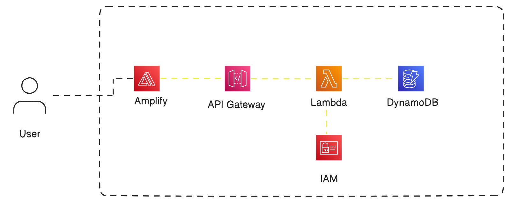

# Power_Math
# To the Power of Math!



## Overview

"To the Power of Math!" is a serverless application that calculates the power of a base number raised to an exponent using AWS services. The project leverages **AWS Lambda**, **Amazon DynamoDB**, **API Gateway**, and **AWS Amplify** for efficient and scalable deployment. A clean and intuitive user interface is created using HTML, CSS, and JavaScript.

---

## Features

1. **User-Friendly Interface**: A visually appealing HTML page to input the base and exponent values.
2. **Serverless Backend**: An AWS Lambda function performs the computation and stores the result in DynamoDB.
3. **Secure API**: API Gateway provides secure endpoints to invoke the Lambda function.
4. **Persistent Storage**: Computation results and execution timestamps are stored in Amazon DynamoDB.
5. **Scalable Hosting**: The front-end is hosted using AWS Amplify for seamless user experience.

---

## Architecture

### Services Used:
- **AWS Lambda**: Executes the mathematical computation (power function) and interacts with DynamoDB.
- **Amazon DynamoDB**: Stores the computation results and their corresponding timestamps.
- **API Gateway**: Acts as a gateway for HTTP requests to invoke the Lambda function.
- **AWS Amplify**: Hosts the front-end HTML page.

---

## Installation and Deployment

### Prerequisites:
- AWS account
- AWS CLI configured
- Basic knowledge of AWS services and JavaScript

### Steps:

#### Backend Setup:
1. **DynamoDB Table**:
   - Create a DynamoDB table named `powerofmath`.
   - Use `ID` as the primary key.

2. **Lambda Function**:
   - Write the Lambda function (`lambda_handler`) in Python.
   - Add necessary permissions to interact with DynamoDB.
   - Deploy the function via AWS Lambda Console or AWS CLI.

3. **API Gateway**:
   - Create a new API and configure a POST endpoint.
   - Integrate the API with the Lambda function.
   - Deploy the API and note the endpoint URL.

#### Front-End Setup:
1. **HTML and JavaScript**:
   - Use the provided `index.html` file.
   - Update the `fetch` URL in the script to match your API Gateway endpoint.

2. **AWS Amplify**:
   - Deploy the front-end using AWS Amplify.
   - Connect your repository or upload the static files manually.

---

## Usage

1. Open the deployed front-end in your browser.
2. Enter the base and exponent values in the respective input fields.
3. Click the **CALCULATE** button.
4. View the result displayed on the page.

---

## Code Explanation

### Lambda Function:
- Extracts `base` and `exponent` from the request.
- Computes the power using Python's `math.pow()`.
- Logs the result and the timestamp in DynamoDB.
- Returns the result as a JSON response.

### HTML & JavaScript:
- A form collects user inputs for `base` and `exponent`.
- JavaScript sends a POST request to the API Gateway endpoint.
- Displays the result or error messages dynamically.

---

## Example Request and Response

### Request:
```
POST https://your-api-endpoint/dev
{
  "base": "2",
  "exponent": "3"
}
```

### Response:
```
{
  "statusCode": 200,
  "body": "Your result is 8.0"
}
```

---

## Technologies Used

- **AWS**: Lambda, DynamoDB, API Gateway, Amplify
- **Languages**: Python, HTML, CSS, JavaScript

---

## Future Enhancements

1. Add user authentication.
2. Implement input validation on the backend.
3. Display a history of calculations stored in DynamoDB.
4. Enhance UI responsiveness.

---


